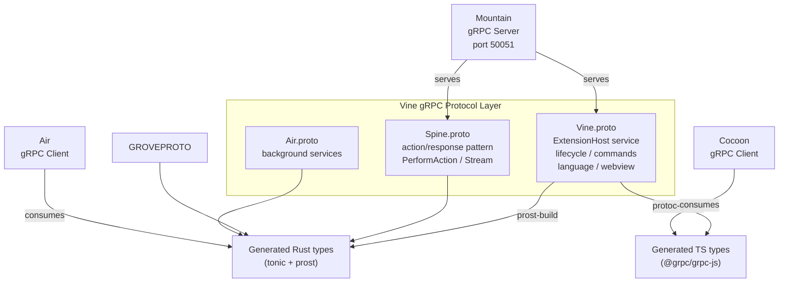

# Vine: gRPC Protocol Layer 🌿

`Vine` is the `gRPC` protocol definition and communication specification for the
`Land` ecosystem. `Vine` defines the strongly-typed IPC layer used for
communication between:

- `Mountain` (`Rust` backend) - gRPC server
- `Cocoon` (`Node.js` extension host) - gRPC client
- `Air` (background daemon) - gRPC client

---

## Table of Contents

1. [Overview](#overview)
2. [Architecture](#architecture)
3. [Protocol Buffers](#protocol-buffers)
4. [Service Definitions](#service-definitions)
5. [Message Types](#message-types)
6. [Client Implementation](#client-implementation)
7. [Server Implementation](#server-implementation)
8. [Port Allocation](#port-allocation)
9. [Code Generation](#code-generation)
10. [Related Documentation](#related-documentation)

---



## Overview 📋

`Vine` defines the `gRPC` service contracts in Protocol Buffer (`.proto`) files:

- These are the source of truth for inter-component communication
- `Rust` code is generated via `prost`/`tonic-build` at compile time
- `TypeScript` code is generated via `protoc-gen-ts`

| Attribute       | Value                                      |
| --------------- | ------------------------------------------ |
| Language        | Protocol Buffers (`.proto`)                |
| Rust impl       | `tonic` (server) + generated `prost` types |
| TypeScript impl | `@grpc/grpc-js` + `protoc-gen-ts`          |
| Transport       | TCP loopback (`127.0.0.1` only)            |
| Security        | No TLS (localhost-only enforced)           |

---

## Architecture 🏗️

`Vine` is the protocol layer that enables all inter-component communication:

```
                    +------------------------------------+
                    |            Vine Protocol            |
                    |  (gRPC service contracts in .proto) |
                    +-------+------------------------+----+
                            |                        |
              +-------------+             +----------+----------+
              |                                     |             |
              v                                     v             v
     +------------------+                +------------------+  +-----+
     | Mountain (Rust)  |                | Cocoon (Node.js) |  | Air |
     | gRPC Server      |<---gRPC------>| gRPC Client      |  |     |
     | (tonic)          |                | (@grpc/grpc-js)  |  |     |
     +------------------+                +------------------+  +-----+
              |
              v
     +------------------+
```

### Protocol Files 📋

| File          | Location                             | Defines                              |
| ------------- | ------------------------------------ | ------------------------------------ |
| `Vine.proto`  | `Element/Mountain/Proto/Vine.proto`  | Core Mountain<->Cocoon gRPC services |
| `Spine.proto` | `Element/Mountain/Proto/Spine.proto` | Extension host coordination protocol |
| `Air.proto`   | (in-source in Air Element)           | Mountain<->Air background services   |

---

## Protocol Buffers 📋

### Vine.proto

```protobuf
syntax = "proto3";
package Vine;

service MountainService {
    rpc ProcessCocoonRequest(GenericRequest) returns (GenericResponse);
    rpc SendCocoonNotification(GenericNotification) returns (Empty);
    rpc CancelOperation(CancelOperationRequest) returns (Empty);
    rpc OpenChannelFromCocoon(stream Envelope) returns (stream Envelope);
}

service CocoonService {
    rpc ProcessMountainRequest(GenericRequest) returns (GenericResponse);
    rpc SendMountainNotification(GenericNotification) returns (Empty);
    rpc CancelOperation(CancelOperationRequest) returns (Empty);
    rpc OpenChannelFromMountain(stream Envelope) returns (stream Envelope);
    rpc InitialHandshake(Empty) returns (Empty);
    rpc InitExtensionHost(InitExtensionHostRequest) returns (Empty);
    rpc RegisterCommand(RegisterCommandRequest) returns (Empty);
    rpc ExecuteContributedCommand(ExecuteCommandRequest) returns (ExecuteCommandResponse);
    rpc UnregisterCommand(UnregisterCommandRequest) returns (Empty);
    rpc RegisterHoverProvider(RegisterProviderRequest) returns (Empty);
    rpc ProvideHover(ProvideHoverRequest) returns (ProvideHoverResponse);
    rpc RegisterCompletionItemProvider(RegisterProviderRequest) returns (Empty);
    rpc ProvideCompletionItems(ProvideCompletionItemsRequest) returns (ProvideCompletionItemsResponse);
    rpc RegisterDefinitionProvider(RegisterProviderRequest) returns (Empty);
    rpc ProvideDefinition(ProvideDefinitionRequest) returns (ProvideDefinitionResponse);
    rpc RegisterReferenceProvider(RegisterProviderRequest) returns (Empty);
    rpc ProvideReferences(ProvideReferencesRequest) returns (ProvideReferencesResponse);
    rpc RegisterCodeActionsProvider(RegisterProviderRequest) returns (Empty);
    rpc ProvideCodeActions(ProvideCodeActionsRequest) returns (ProvideCodeActionsResponse);
    rpc RegisterDocumentHighlightProvider(RegisterProviderRequest) returns (Empty);
    rpc ProvideDocumentHighlights(ProvideDocumentHighlightsRequest) returns (ProvideDocumentHighlightsResponse);
    rpc RegisterDocumentSymbolProvider(RegisterProviderRequest) returns (Empty);
    rpc ProvideDocumentSymbols(ProvideDocumentSymbolsRequest) returns (ProvideDocumentSymbolsResponse);
    rpc RegisterWorkspaceSymbolProvider(RegisterProviderRequest) returns (Empty);
    rpc ProvideWorkspaceSymbols(ProvideWorkspaceSymbolsRequest) returns (ProvideWorkspaceSymbolsResponse);
}

message Empty {}
message Envelope { ... }
message GenericRequest { ... }
message GenericResponse { ... }
message GenericNotification { ... }
message RPCError { ... }
message CancelOperationRequest { ... }
message Position { ... }
message Range { ... }
message Uri { ... }
message WorkspaceFolder { ... }
message CompletionItem { ... }
message Location { ... }
```

---

## Service Definitions

### MountainService (`Cocoon` -> `Mountain`)

| RPC                      | Direction              | Purpose                                |
| ------------------------ | ---------------------- | -------------------------------------- |
| `ProcessCocoonRequest`   | `Cocoon` -> `Mountain` | Generic request-response               |
| `SendCocoonNotification` | `Cocoon` -> `Mountain` | Fire-and-forget event                  |
| `CancelOperation`        | `Cocoon` -> `Mountain` | Cancel an in-flight request            |
| `OpenChannelFromCocoon`  | `Cocoon` -> `Mountain` | LAND-PATCH B7-S6 P2 multiplexed stream |

### CocoonService (`Mountain` -> `Cocoon`)

| RPC                         | Direction              | Purpose                                |
| --------------------------- | ---------------------- | -------------------------------------- |
| `ProcessMountainRequest`    | `Mountain` -> `Cocoon` | Generic request-response               |
| `SendMountainNotification`  | `Mountain` -> `Cocoon` | Fire-and-forget notification           |
| `CancelOperation`           | `Mountain` -> `Cocoon` | Cancel an in-flight request            |
| `OpenChannelFromMountain`   | `Mountain` -> `Cocoon` | LAND-PATCH B7-S6 P2 multiplexed stream |
| `InitExtensionHost`         | `Mountain` -> `Cocoon` | Send workspace / extensions / config   |
| `ExecuteContributedCommand` | `Mountain` -> `Cocoon` | Execute an extension command           |
| `ProvideHover`              | `Mountain` -> `Cocoon` | Request hover from provider            |
| `ProvideCompletionItems`    | `Mountain` -> `Cocoon` | Request completion items               |
| `ProvideDefinition`         | `Mountain` -> `Cocoon` | Request definition location            |
| `ProvideReferences`         | `Mountain` -> `Cocoon` | Request reference locations            |
| `ProvideCodeActions`        | `Mountain` -> `Cocoon` | Request code actions                   |
| `ProvideDocumentHighlights` | `Mountain` -> `Cocoon` | Request document highlights            |
| `ProvideDocumentSymbols`    | `Mountain` -> `Cocoon` | Request document symbols               |
| `ProvideWorkspaceSymbols`   | `Mountain` -> `Cocoon` | Request workspace symbols              |

`Air` speaks `Vine` via its own `AirService` (see `Element/Air/Proto/Air.proto`)
on port `50053`.

Streaming (`OpenChannelFromMountain` / `OpenChannelFromCocoon`) replaces the
older unary path for any caller that needs concurrent dispatch. Unary RPCs are
preserved for backward compatibility.

### Spine Service (Cocoon -> Mountain) 🔗

| RPC             | Direction          | Purpose                          |
| --------------- | ------------------ | -------------------------------- |
| `PerformAction` | Cocoon -> Mountain | Execute an ActionEffect natively |
| `CancelAction`  | Cocoon -> Mountain | Cancel an in-flight action       |
| `StreamActions` | Cocoon -> Mountain | Open action streaming channel    |

---

## Message Types 📨

### Initialize 📦

```protobuf
message InitRequest {
    string workspace_path = 1;
    string app_root = 2;
    repeated ExtensionManifest extensions = 3;
    Configuration configuration = 4;
    map<string, string> environment = 5;
    string commit_hash = 6;
    ProductInfo product = 7;
}

message ProductInfo {
    string name = 1;
    string version = 2;
    string commit = 3;
    string quality = 4;
}
```

### Commands ⌨️

```protobuf
message CommandRequest {
    string command_id = 1;
    repeated bytes args = 2;       // Serialized arguments
    string caller_id = 3;
}

message CommandResponse {
    bytes result = 1;             // Serialized result
    bool success = 2;
    string error = 3;
}
```

### Language Features 📝

```protobuf
message HoverRequest {
    string document_uri = 1;
    uint32 line = 2;
    uint32 column = 3;
}

message HoverResponse {
    string markup_content = 1;    // Markdown string
    uint32 range_start_line = 2;
    uint32 range_start_column = 3;
    uint32 range_end_line = 4;
    uint32 range_end_column = 5;
}
```

---

## Client Implementation 💻

`Cocoon`'s `gRPC` client (`Cocoon/Source/Services/Mountain/gRPC/Client.ts`) uses
`@grpc/grpc-js`:

```typescript
import * as grpc from "@grpc/grpc-js";

import { ExtensionHostClient } from "./generated/vine";

const client = new ExtensionHostClient(
	`127.0.0.1:${config.networkMountainPort}`,
	grpc.credentials.createInsecure(),
);

// Execute command via gRPC
const response = await new Promise<CommandResponse>((resolve, reject) => {
	client.executeCommand(
		{ commandId, args: serializedArgs, callerId },
		(error, response) => {
			if (error) reject(error);
			else resolve(response);
		},
	);
});
```

---

## Server Implementation 💻

`Mountain`'s `gRPC` server (`Mountain/Source/Vine/Server/`) uses `tonic`:

```rust
use tonic::{Request, Response, Status};
use editor::land::vine::{
    extension_host_server::{ExtensionHost, ExtensionHostServer},
    CommandRequest, CommandResponse,
};

#[tonic::async_trait]
impl ExtensionHost for VineServiceImpl {
    async fn execute_command(
        &self,
        request: Request<CommandRequest>,
    ) -> Result<Response<CommandResponse>, Status> {
        let cmd = request.into_inner();
        let result = self.command_executor
            .execute(&cmd.command_id, cmd.args)
            .await
            .map_err(|e| Status::internal(e.to_string()))?;
        Ok(Response::new(CommandResponse {
            result: result.into(),
            success: true,
            error: String::new(),
        }))
    }
}
```

---

## Port Allocation 🔢

| Service       | Port  | Transport    | Components                         |
| ------------- | ----- | ------------ | ---------------------------------- |
| Mountain Vine | 50051 | TCP loopback | Mountain (server), Cocoon (client) |
| Cocoon Vine   | 50052 | TCP loopback | Cocoon (server), Mountain (client) |
| Air Vine      | 50053 | TCP loopback | Air (server)                       |

Ports can be overridden via environment variables:

- `NetworkMountainPort` (default: 50051)
- `NetworkCocoonPort` (default: 50052)
- `NetworkAirPort` (default: 50053)

---

## Code Generation ⚙️

### Rust (compile-time via build.rs) ⚙️

```rust
// Mountain/build.rs
fn main() {
    tonic_build::configure()
        .compile(&["Proto/Vine.proto", "Proto/Spine.proto"], &["Proto"])
        .expect("Failed to compile protos");
}
```

### TypeScript (pre-generated via protoc-gen-ts) ⚙️

```sh
protoc \
	--ts_out=Element/Cocoon/Source/Generated/ \
	--ts_opt=target=node \
	--proto_path=Element/Mountain/Proto/ \
	Element/Mountain/Proto/Vine.proto
```

- Generated `TypeScript` types are committed to the `Cocoon` source tree

---

## Related Documentation 📚

- [Mountain](https://github.com/CodeEditorLand/Mountain/tree/Current/Documentation/GitHub/Architecture.md) -
  `gRPC` server implementation
- [Cocoon](https://github.com/CodeEditorLand/Cocoon/tree/Current/Documentation/GitHub/Architecture.md) -
  `gRPC` client implementation
- [Air](https://github.com/CodeEditorLand/Air/tree/Current/Documentation/GitHub/Architecture.md) -
  Background daemon (`gRPC` consumer)
- [Grove](https://github.com/CodeEditorLand/Grove/tree/Current/Documentation/GitHub/Architecture.md) -
  WASM host (`gRPC` consumer)
- [InterComponentProtocol](https://github.com/CodeEditorLand/Land/tree/Current/Documentation/GitHub/InterComponentProtocol.md) -
  Full protocol specification

---

## Shim Compatibility

| 🟠 Low-Level Shim | 🔵 Coverage Shim |
|-------------------|-----------------|
| Tier: `TierShim=Own\|Preempt` | Tier: `TierShim=Proxy\|Replace` |
| Engine prototype hooks | Service routing + audit |
| Error, Emitter, Cancel, Dispose, Async, Timing | IPC SwallowMap, DI proxy, AuditLog |

> This Element supports the Land deep-shim interception system. The shim
> intercepts VS Code engine events at both the JavaScript prototype level (🟠 orange)
> and the application service level (🔵 blue). Gated behind `TierShim` env var
> (default: `None` — zero overhead). See the [Shim documentation](/doc/low-level-shim).

**Shim Modules:** No shim-specific modules — events routed through `Wind`/`Mountain`/`Cocoon`.

---

**Project Maintainers:** Source Open
([Source/Open@Editor.Land](mailto:Source/Open@Editor.Land)) |
[GitHub Repository](https://github.com/CodeEditorLand/Land) |
[Report an Issue](https://github.com/CodeEditorLand/Land/issues)
