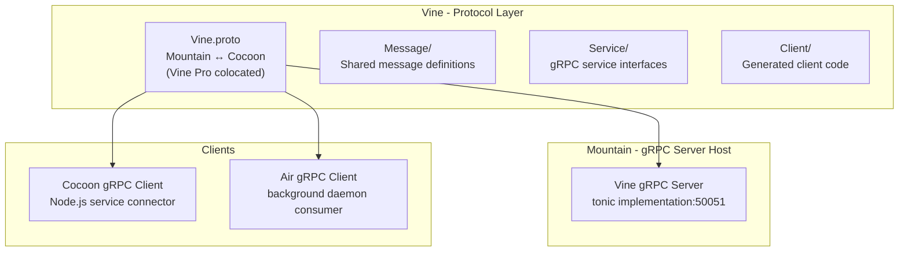
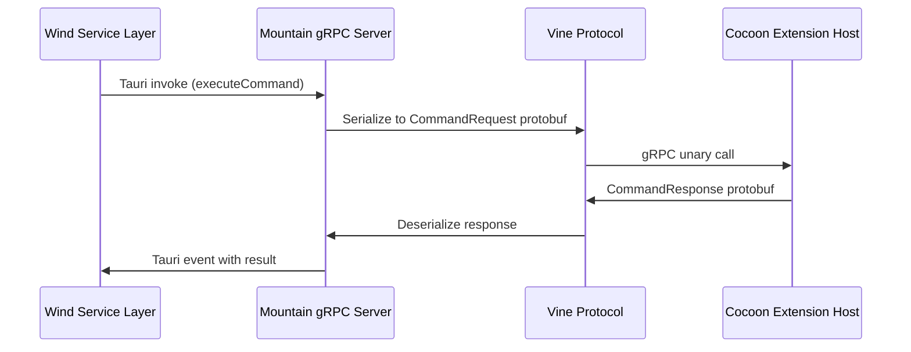

# Vine - Deep Dive

Vine provides the technical foundation gRPC protocol layer within the Land
ecosystem. **Vine** defines the strongly-typed inter-process communication
contracts used between Mountain and Cocoon, with Air as an additional gRPC
consumer.

---

## Architecture

Vine is a contract-first protocol layer. The `.proto` file is the source of
truth; generated Rust code via `prost-build`/`tonic` is shared by Mountain, Air,
and Cocoon.

---

## Key Modules

| Path                    | Description                                                              |
| :---------------------- | :----------------------------------------------------------------------- |
| `Proto/Vine.proto`      | Canonical protocol schema (only schema shipped)                          |
| `Source/Library.rs`     | Crate root: port constants, protocol version, constants                  |
| `Source/Host.rs`        | `VineHost` + `IPCProvider` embedder seam                                 |
| `Source/Generated/`     | prost-built types + tonic clients/servers from `Proto/Vine.proto`        |
| `Source/Client/`        | Connection helpers, request/notification dispatch, sidecar health checks |
| `Source/Server/`        | Bind helpers + notification handler tree                                 |
| `Source/Multiplexer.rs` | Bidirectional streaming envelope multiplexer (`LAND_VINE_STREAMING=1`)   |
| `Source/Error.rs`       | Canonical `VineError` variants                                           |

The protocol implementation spans Mountain's `Source/RPC/Vine/` (server), Air's
Vine client modules, and Cocoon's `Source/Effect/RPCServer.ts` (client). The
Vine Element owns the schema and shared Rust types.

---

## Data Flow

The following diagram shows how a VS Code command travels from Sky/Wind through
the Vine protocol to Cocoon and back.

**Communication patterns supported by Vine:**

- **Unary RPC** - Request/response for commands and queries.
- **Server streaming** - Mountain streams events (terminal output, diagnostics)
  to Cocoon.
- **Client streaming** - Cocoon sends batched registration calls at startup.
- **Bidirectional streaming** - Used by the Spine protocol for real-time
  extension host coordination.

---

## Integration Points

| Connecting Element | Direction       | Mechanism                  | Description                                                        |
| :----------------- | :-------------- | :------------------------- | :----------------------------------------------------------------- |
| **Mountain**       | Server          | tonic gRPC server          | Hosts Vine server on `50051`; handles incoming RPC from Cocoon/Air |
| **Cocoon**         | Client          | Node.js `grpc-js` / Bridge | Connects to Mountain's Vine server                                 |
| **Air**            | Server + Client | tonic gRPC                 | Hosts AirService on `50053`; also connects back to Mountain        |

**Listening addresses:**

| Service       | Address       |
| :------------ | :------------ |
| Mountain Vine | `[::1]:50051` |
| Cocoon Vine   | `[::1]:50052` |
| Air Vine      | `[::1]:50053` |

---

## Configuration

| Parameter | Value                  | Description                                      |
| :-------- | :--------------------- | :----------------------------------------------- |
| Transport | TCP loopback           | `[::1]` only; no external exposure               |
| TLS       | Disabled for local IPC | Mist DNS isolation enforces the network boundary |

Addresses are listed in [Integration Points](#integration-points).

---

**Project Maintainers:** Source Open
([Source/Open@Editor.Land](mailto:Source/Open@Editor.Land)) |
[GitHub Repository](https://github.com/CodeEditorLand/Land) |
[Report an Issue](https://github.com/CodeEditorLand/Land/issues)
