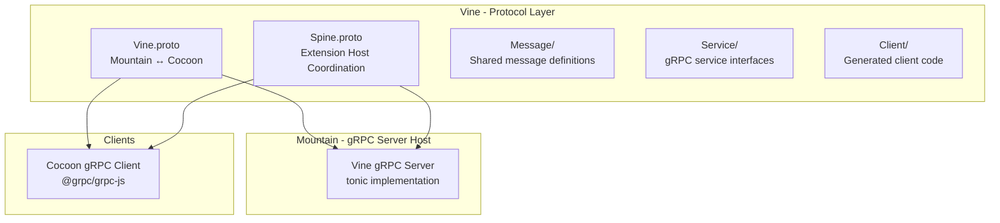
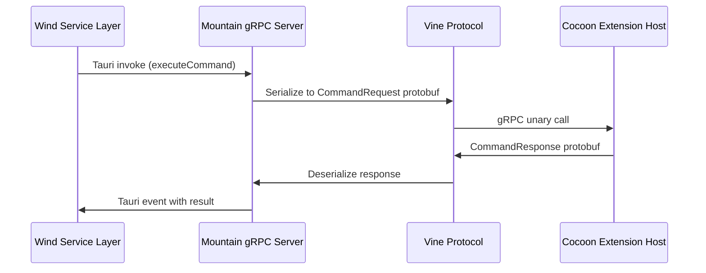

# Vine - Deep Dive

This document provides the technical foundation for the Vine gRPC protocol layer
within the Land ecosystem. **Vine** defines the strongly-typed inter-process
communication contracts used between Mountain and Cocoon, with Air as an additional gRPC consumer.

---

## Architecture

Vine is a contract-first protocol layer. The `.proto` files are the source of
truth; generated Rust code from `tonic`/`prost` is used by Mountain for the
server implementation and by Cocoon for client stubs.

---

## Key Modules

| Path                | Description                                                                |
| :------------------ | :------------------------------------------------------------------------- |
| `Proto/Vine.proto`  | Core protocol: Mountain ↔ Cocoon commands, events, handshake               |
| `Proto/Spine.proto` | Extension host coordination: action/response pattern for command execution |
| `Source/lib.rs`     | Library root; re-exports generated types                                   |
| `Source/Message/`   | Structured message type definitions shared across services                 |
| `Source/Service/`   | gRPC service trait implementations                                         |
| `Source/Client/`    | Protocol client helpers for consumer crates                                |

The current protocol implementation resides in Mountain's `Vine/` directory
(server side) and in Cocoon's `Services/MountainGRPCClient.ts` (client side).
The Vine Element is the canonical home for the `.proto` definitions.

---

## Data Flow

The following diagram shows how a VS Code command travels from Sky/Wind through
the Vine protocol to Cocoon and back.

**Communication patterns supported by Vine:**

- **Unary RPC** - Request/response for commands and queries.
- **Server streaming** - Mountain streams events (terminal output, diagnostics)
  to Cocoon.
- **Client streaming** - Cocoon sends batched registration calls at startup.
- **Bidirectional streaming** - Used by the Spine protocol for real-time
  extension host coordination.

---

## Integration Points

| Connecting Element | Direction | Mechanism         | Description                                                             |
| :----------------- | :-------- | :---------------- | :---------------------------------------------------------------------- |
| **Mountain**       | Server    | tonic gRPC server | Hosts Vine and Air gRPC services; handles all incoming RPC calls        |
| **Cocoon**         | Client    | `@grpc/grpc-js`   | Node.js client connecting to Mountain's Vine server on port 50052       |

---

## Configuration

| Parameter        | Value               | Description                                                        |
| :--------------- | :------------------ | :----------------------------------------------------------------- |
| Vine/Cocoon port | `50052`             | Mountain gRPC server port for extension host communication         |
| Transport        | TCP (loopback)      | All gRPC connections use `[::1]` (IPv6 loopback)                   |
| TLS              | Disabled (loopback) | No TLS for local IPC; Mist DNS isolation provides network boundary |

Protocol buffer files are compiled at build time by `prost-build` in Mountain's
`build.rs`. The generated Rust types are used directly by Mountain's `Vine/` and
the Air daemon's own server modules.
