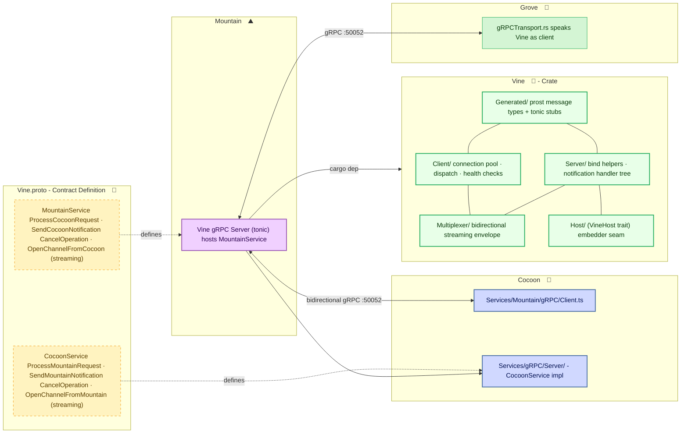

# **Vine**&#x2001;🌿

<table>
	<tr>
		<td>
			<a href="https://GitHub.Com/CodeEditorLand/Vine" target="_blank">
				<picture>
					<source media="(prefers-color-scheme: dark)" srcset="https://img.shields.io/github/last-commit/CodeEditorLand/Vine?label=Update&color=black&labelColor=black&logoColor=white&logoWidth=0" />
					<source media="(prefers-color-scheme: light)" srcset="https://img.shields.io/github/last-commit/CodeEditorLand/Vine?label=Update&color=white&labelColor=white&logoColor=black&logoWidth=0" />
					
				</picture>
			</a>
			<br />
			<a href="https://GitHub.Com/CodeEditorLand/Vine" target="_blank">
				<picture>
					<source media="(prefers-color-scheme: dark)" srcset="https://img.shields.io/github/issues/CodeEditorLand/Vine?label=Issue&color=black&labelColor=black&logoColor=white&logoWidth=0" />
					<source media="(prefers-color-scheme: light)" srcset="https://img.shields.io/github/issues/CodeEditorLand/Vine?label=Issue&color=white&labelColor=white&logoColor=black&logoWidth=0" />
					
				</picture>
			</a>
		</td>
		<td>
			<a href="https://github.com/CodeEditorLand/Vine" target="_blank">
				<picture>
					<source media="(prefers-color-scheme: dark)" srcset="https://img.shields.io/github/stars/CodeEditorLand/Vine?style=flat&label=Star&logo=github&color=black&labelColor=black&logoColor=white&logoWidth=0" />
					<source media="(prefers-color-scheme: light)" srcset="https://img.shields.io/github/stars/CodeEditorLand/Vine?style=flat&label=Star&logo=github&color=white&labelColor=white&logoColor=black&logoWidth=0" />
					
				</picture>
			</a>
			<br />
			<a href="https://GitHub.Com/CodeEditorLand/Vine" target="_blank">
				<picture>
					<source media="(prefers-color-scheme: dark)" srcset="https://img.shields.io/github/downloads/CodeEditorLand/Vine/total?label=Download&color=black&labelColor=black&logoColor=white&logoWidth=0" />
					<source media="(prefers-color-scheme: light)" srcset="https://img.shields.io/github/downloads/CodeEditorLand/Vine/total?label=Download&color=white&labelColor=white&logoColor=black&logoWidth=0" />
					
				</picture>
			</a>
		</td>
	</tr>
</table>

The `gRPC` Protocol Layer for the Land Editor&#x2001;🏞️

> **Every component in Land talks to every other component through a
> well-defined, strongly-typed schema. That schema is Vine.**

_"One `.proto` file. Every service. Type safety from compile time to wire."_

[](https://github.com/CodeEditorLand/Vine/tree/Current/LICENSE)
[](https://www.rust-lang.org/) [](https://crates.io/crates/Vine)
[](https://www.rust-lang.org/) [](https://www.rust-lang.org/)

**[Rust API Documentation](https://rust.documentation.vine.editor.land/)**&#x2001;📖

---

## Overview

**Vine** is the communication layer for the **Land** Code Editor. It defines how
every component talks to every other component - what messages they can send,
what responses they expect, and how data streams between them.

All IPC in Land is defined in a single file: `Proto/Vine.proto`. This file
declares every RPC method, every message type, and every streaming channel the
system needs. From this one source, the build system generates type-safe Rust
clients and servers (using `tonic` / `prost`), while the `Node.js` extension
host mirrors the same definitions in TypeScript.

The components that speak Vine: **Mountain**&#x2001;⛰️ (the Rust
backend), **Cocoon**&#x2001;🦋 (the `Node.js` extension host),
**Air**&#x2001;🪁 (the background daemon), and
**Grove**&#x2001;🌳 (the Rust/`WASM` extension host).

**Vine is engineered to:**

1. **Centralize Protocol Contracts** - One `.proto` file is the sole authority
   for every `gRPC` service, message, and streaming envelope in the Land
   ecosystem.
2. **Generate Type-Safe Bindings** - `Prost`-backed Rust code is generated at
   build time from `Proto/Vine.proto`, giving every consumer compile-time
   guarantees against wire-format drift.
3. **Provide Runtime Scaffolding** - Client connection pools, server bind
   helpers, notification handler dispatch trees, and a bidirectional envelope
   multiplexer ship as cargo features.
4. **Support Multiple Embedders** - The `VineHost` trait abstracts the embedder
   runtime (`Mountain`, `Air`, `Cocoon`-Rust) so a single handler tree works
   against any host.

---

## Key Features&#x2001;🌿

**Single-Source Protocol** - Every `gRPC` contract lives in `Proto/Vine.proto`,
the canonical specification for `MountainService` (hosted by `Mountain`) and
`CocoonService` (hosted by the `Cocoon` sidecar). `build.rs` feeds this file to
`tonic-prost-build`, producing `Source/Generated/vine.rs` with all message
types, clients, and server traits.

**Feature-Gated Runtime** - The crate is split into three optional features so
consumers only compile what they need: `client` (connection pool, request
dispatch, health checks), `server` (bind helpers, notification handler tree),
and `multiplexer` (bidirectional streaming over a single HTTP/2 connection).

**Embedder-Agnostic Handler Tree** - The `VineHost` trait is the seam between
Vine and its consumer runtime. Notification handlers operate on `&dyn VineHost`,
so the same handler tree works in `Mountain` (Tauri renderer dispatch), `Air`
(daemon-only, no renderer), or any future embedder. Every handler file lives
under `Source/Server/Notification/`.

**Client Connection Pool** - A `DashMap`-backed pool of `tonic` `gRPC` channels
with exponential-backoff connection logic, subscriber fan-out for notification
broadcast, and atomic shutdown signalling. Entries under `Source/Client/` cover
every client-side operation.

**Structured Error Types** - `VineError` enumerates every failure mode with
recoverability predicates and `tonic::Status` mapping. Callers use
`IsRecoverable()` to decide between retry, fallback, and surfacing.

**Bidirectional Multiplexer** - `Source/Multiplexer.rs` implements the streaming
envelope protocol (`OpenChannelFromCocoon` / `OpenChannelFromMountain`, per
LAND-PATCH B7-S6 P14.1) for concurrent dispatch over a single HTTP/2 stream.

---

## Core Architecture Principles&#x2001;🏗️

| Principle                 | Description                                                                                                                            | Key Components                                                                     |
| ------------------------- | -------------------------------------------------------------------------------------------------------------------------------------- | ---------------------------------------------------------------------------------- |
| **Single Authority**      | One `.proto` file defines every contract. No duplication, no drift.                                                                    | `Proto/Vine.proto`, `Source/Generated/`, `build.rs`                                |
| **Type Safety**           | `Prost`-generated code ensures every message, RPC, and streaming frame matches the proto schema at compile time.                       | `Source/Generated/vine.rs`, `tonic-prost-build`                                    |
| **Transport Agnosticism** | The `VineHost` trait and `tonic`'s transport layer abstract the actual network substrate. Local `[::1]` or remote - same handler tree. | `VineHost` trait, `tonic` `Server`/`Channel`                                       |
| **Composability**         | Each feature module (`client`, `server`, `multiplexer`) compiles independently so consumers pay only for what they use.                | `Cargo.toml` features, `Source/Client/`, `Source/Server/`, `Source/Multiplexer.rs` |

---

## System Architecture



**Connection paths:**

| Path                                          | Protocol                       | Use Case                                          |
| --------------------------------------------- | ------------------------------ | ------------------------------------------------- |
| **Mountain**&#x2001;⛰️ → **Cocoon**&#x2001;🦋 | `gRPC` on port 50052           | Backend-to-extension-host dispatch                |
| **Cocoon**&#x2001;🦋 → **Mountain**&#x2001;⛰️ | `gRPC` on port 50051           | Extension invocation of editor operations         |
| **Air**&#x2001;🪁 → **Mountain**&#x2001;⛰️    | `gRPC` on port 50051           | Daemon queries for indexing/update/download tasks |
| **Mountain**&#x2001;⛰️ → **Air**&#x2001;🪁    | `gRPC` on port 50053           | Editor-to-daemon service calls                    |
| **Grove**&#x2001;🌳 → **Mountain**&#x2001;⛰️  | `gRPC` on port 50052           | Native `WASM` extension host communication        |
| Multiplexer stream                            | HTTP/2 bidirectional streaming | Concurrent dispatch over single connection        |

---

## Key Components

| Component              | Path                                | Description                                                                                                          |
| ---------------------- | ----------------------------------- | -------------------------------------------------------------------------------------------------------------------- |
| Proto Definition       | `Proto/Vine.proto`                  | Canonical `gRPC` service and message definitions for the entire Land ecosystem                                       |
| Generated Bindings     | `Source/Generated/vine.rs`          | `tonic-prost-build` output: message types, client stubs, server traits                                               |
| Client Connection Pool | `Source/Client/`                    | `DashMap`-backed pool of `tonic` channels with exponential-backoff connect, notification fan-out, and health checks  |
| SendRequest            | `Source/Client/SendRequest.rs`      | Unary request dispatch with configurable timeout and streaming-multiplexer fast path                                 |
| SendNotification       | `Source/Client/SendNotification.rs` | Fire-and-forget notification dispatch with broadcast fan-out                                                         |
| Server Bind Helpers    | `Source/Server/`                    | `SpawnBindTask`, `SpawnBindTaskWithShutdown`, `ValidateSocketAddress` - boilerplate every embedder needs             |
| Notification Handlers  | `Source/Server/Notification/`       | Per-file handler tree for Cocoon → Mountain notifications with payload reshaping, coalescing, and multi-step logic   |
| VineHost Trait         | `Source/Host.rs`                    | Embedder seam: application state access, renderer emission, IPC provider, command/SCM/terminal/language registration |
| Error Types            | `Source/Error.rs`                   | `VineError` enum with recoverability predicates and `tonic::Status` mapping                                          |
| Multiplexer            | `Source/Multiplexer.rs`             | Bidirectional streaming envelope protocol (LAND-PATCH B7-S6 P14.1)                                                   |
| Library Root           | `Source/Library.rs`                 | Crate root: module declarations, protocol constants (`ProtocolVersion`, `DefaultMaxMessageSize`, default addresses)  |

---

## Project Structure&#x2001;🗺️

```
Element/Vine/
├── Proto/
│   └── Vine.proto                   # Canonical gRPC contract (MountainService + CocoonService)
├── Source/
│   ├── Library.rs                   # Library root (rlib)
│   ├── DevLog.rs                    # Development logging infrastructure
│   ├── Error.rs                     # VineError enum + From impls + tonic::Status mapping
│   ├── Host.rs                      # VineHost trait + IPCProvider + ApplicationStateAccess + RendererEmitter
│   ├── Generated/
│   │   ├── mod.rs                   # Module docs + re-exports
│   │   └── vine.rs                  # prost-built message types + tonic clients/servers
│   ├── Client/                      # Client-side gRPC wrappers (feature = "client")
│   │   ├── mod.rs                   # Module docs + public module list
│   │   ├── Shared.rs                # Module-private state (statics, helpers, constants)
│   │   ├── MarkShutdown.rs          # Process-wide shutdown flag
│   │   ├── IsShuttingDown.rs        # Shutdown flag reader
│   │   ├── NotificationFrame.rs     # Broadcast payload struct
│   │   ├── SubscribeNotifications.rs # Notification fan-out registration
│   │   ├── SubscriberCount.rs       # Active subscriber counter
│   │   ├── ConnectToSideCar.rs      # Pool-lifecycle connect (3-attempt backoff)
│   │   ├── DisconnectFromSideCar.rs # Pool-lifecycle disconnect
│   │   ├── TryConnectSingle.rs      # Single connection attempt with h2 tuning
│   │   ├── IsClientConnected.rs     # Pool readiness check
│   │   ├── WaitForClientConnection.rs # Boot-race-friendly async readiness
│   │   ├── CheckSideCarHealth.rs    # Pool + metadata health summary
│   │   ├── SendRequest.rs           # Unary request dispatch with timeout + streaming fast path
│   │   ├── SendNotification.rs      # Fire-and-forget notification dispatch
│   │   ├── PublishNotification.rs   # Private broadcast publisher
│   │   └── PublishNotificationFromMux.rs # Pub(crate) multiplexer broadcast publisher
│   ├── Server/                      # Server-side gRPC scaffolding (feature = "server")
│   │   ├── mod.rs                   # Module docs + embedder call pattern
│   │   ├── Constants.rs             # Default ports / timeouts / message-size cap
│   │   ├── ValidateSocketAddress.rs # Port-and-format pre-flight check
│   │   ├── SpawnBindTask.rs         # Detached tokio::spawn server runner
│   │   ├── SpawnBindTaskWithShutdown.rs # Drain-capable server runner
│   │   └── Notification/            # Cocoon → Mountain handler tree
│   │       ├── mod.rs               # Handler module listing with logic annotations
│   │       ├── Support/
│   │       │   ├── mod.rs           # Shared handler utilities
│   │       │   ├── RelayToSky.rs    # Single sky-event forward
│   │       │   └── UnregisterByHandle.rs # Provider unregistration by handle
│   │       ├── OutputAppendLine.rs  # Output channel append with payload reshape
│   │       ├── OutputChannelAppend.rs
│   │       ├── OutputChannelCoalesce.rs # Channel-drain coalescer
│   │       ├── OutputChannelHide.rs
│   │       ├── OutputChannelReplace.rs
│   │       ├── OutputReplace.rs
│   │       ├── ProgressStart.rs     # Progress lifecycle handlers with coalescing
│   │       ├── ProgressReport.rs
│   │       ├── ProgressEnd.rs
│   │       ├── WebviewDispose.rs    # Webview lifecycle management
│   │       ├── WebviewPostMessage.rs
│   │       ├── WebviewLifecycle.rs
│   │       ├── WebviewReady.rs
│   │       ├── WindowShowMessage.rs # Window message display
│   │       ├── DecorationTypeLifecycle.rs # Text-editor decoration batching
│   │       ├── SetTextEditorDecorations.rs
│   │       ├── ApplyTextEdits.rs    # Editor text mutations
│   │       ├── SetLanguageConfiguration.rs # Language-feature configuration
│   │       ├── RegisterCommand.rs   # Command registry operations
│   │       ├── UnregisterCommand.rs
│   │       ├── RegisterLanguageProvider.rs # Language-feature provider registration
│   │       ├── StatusBarLifecycle.rs # StatusBar item lifecycle
│   │       ├── StatusBarMessage.rs
│   │       ├── SetStatusBarText.rs
│   │       ├── DisposeStatusBarItem.rs
│   │       ├── DebugLifecycle.rs    # Debug adapter lifecycle
│   │       ├── TerminalLifecycle.rs # Terminal lifecycle management
│   │       ├── WindowCreateTerminal.rs
│   │       ├── RegisterScmProvider.rs # SCM provider registration
│   │       ├── RegisterScmResourceGroup.rs
│   │       ├── UnregisterScmProvider.rs
│   │       ├── UpdateScmGroup.rs    # SCM group update dispatch
│   │       ├── OpenExternal.rs      # External URI/URL opening
│   │       ├── SecurityIncident.rs  # Security incident notification
│   │       └── ...                  # Pure-relay atoms inlined in Mountain dispatcher
│   └── Multiplexer.rs               # Bidirectional streaming envelope (feature = "multiplexer")
├── build.rs                         # tonic-build + tonic-prost-build codegen
├── Cargo.toml                       # Crate manifest with feature flags
└── Documentation/
    └── GitHub/
        ├── Architecture.md          # Full protocol specification and module structure
        └── DeepDive.md             # In-depth technical details
```

---

## In the Land Project

Vine is the `gRPC` contract layer that wires every Land component together. It
is not the implementation - it is the specification and the shared runtime that
all implementations conform to:

| Component              | Role                                            | Port  | Consumes Vine                        |
| ---------------------- | ----------------------------------------------- | ----- | ------------------------------------ |
| **Mountain**&#x2001;⛰️ | Desktop shell, hosts `MountainService`          | 50051 | `server` feature                     |
| **Cocoon**&#x2001;🦋   | `Node.js` extension host, hosts `CocoonService` | 50052 | TypeScript mirror of proto           |
| **Air**&#x2001;🪁      | Background daemon, hosts `AirService`           | 50053 | `client` feature                     |
| **Grove**&#x2001;🌳    | Rust/`WASM` extension host                      | -     | `client` feature via `gRPCTransport` |

Vine is part of the Land networking/IPC connectivity stack alongside
**Air**&#x2001;🪁 (background daemon, uses Vine/`gRPC` on port 50053 for
`AirService`) and **Mist**&#x2001;🌫️ (DNS isolation, used by Air's HTTP
client).

The `VineHost` trait abstracts the embedder runtime so a single notification
handler tree works across all consumers. `Mountain` wires `EmitToRenderer` to
`tauri::WebviewWindow::emit`; `Air` leaves it as a no-op. The `client` feature
gives every consumer a connection pool, health checks, and exponential-backoff
reconnect - all driven by the same `Proto/Vine.proto` contract.

---

## Getting Started&#x2001;🚀

### Prerequisites

- **Rust** 1.95.0 or later (workspace MSRV; edition 2024)
- Protocol Buffer compiler (`protoc`, optional - only needed for proto file
  modifications)

### Build

```bash
cd Element/Vine
cargo build --release
```

### Build with Features

```bash
# All features enabled
cargo build --release --all-features

# Server only (for embedders hosting a Vine service)
cargo build --release --features server

# Client only (for embedders calling Vine services)
cargo build --release --features client

# With bidirectional multiplexer
cargo build --release --features server,client,multiplexer
```

### Available Features

| Feature       | Default | Description                                                                |
| ------------- | :-----: | -------------------------------------------------------------------------- |
| `default`     |    -    | Enables `server` and `client`                                              |
| `server`      |   ✅    | Server-side `gRPC` handler scaffolding (`Mountain` consumes this)          |
| `client`      |   ✅    | Client-side `gRPC` stubs and connection pool (`Air`, `Grove` consume this) |
| `multiplexer` |         | Bidirectional envelope multiplexer (LAND-PATCH B7-S6 P14.1)                |

### As a Library

```rust
use Vine::{
    Client::{ConnectToSideCar, SendRequest, SendNotification},
    Server::{Constants, SpawnBindTask, ValidateSocketAddress},
    Error::VineError,
};

#[tokio::main]
async fn main() -> anyhow::Result<()> {
    // Server-side: bind a Vine service
    let Address = ValidateSocketAddress::Fn("[::1]:50051", "MountainService")?;
    let Service = MyMountainServiceImpl::new(state);
    let Wrapped = MountainServiceServer::new(Service)
        .max_decoding_message_size(Constants::MAX_MESSAGE_SIZE);
    let Router = tonic::transport::Server::builder().add_service(Wrapped);
    SpawnBindTask::Fn("MountainService".to_string(), Address, Router);

    // Client-side: connect and dispatch
    ConnectToSideCar::Fn("cocoon-main", "[::1]:50052").await?;
    SendRequest::Fn("cocoon-main", "some-method", payload, None).await?;
    Ok(())
}
```

---

## Security&#x2001;🔒

Vine itself does not enforce security - it is a protocol layer. Security
boundaries live in the embedders:

| Layer                  | Mechanism                                                                                                             |
| ---------------------- | --------------------------------------------------------------------------------------------------------------------- |
| **Transport**          | `tonic` enforces HTTP/2 TLS when configured with certificates; Vine transports bind to `[::1]` (localhost) by default |
| **Message validation** | `ValidateSocketAddress` pre-flight checks; `DefaultMaxMessageSize` (4 MB) enforced at the envelope boundary           |
| **Type safety**        | `Prost`-generated code ensures every message conforms to the proto schema at compile time                             |
| **Feature isolation**  | Each cargo feature (`client`, `server`, `multiplexer`) compiles independently - embedders only compile what they use  |

For extension sandboxing, see **Grove**&#x2001;🌳 (hardware-enforced
`WASMtime` isolation). For renderer isolation, see
**Mountain**&#x2001;⛰️ (process-per-window via `Tauri`).

---

## Compatibility

Vine is designed to be compatible with:

| Target                 | Integration                                                                                       |
| ---------------------- | ------------------------------------------------------------------------------------------------- |
| **Mountain**&#x2001;⛰️ | Hosts `MountainService`; implements `VineHost` with `Tauri` renderer dispatch                     |
| **Cocoon**&#x2001;🦋   | TypeScript `@grpc/grpc-js` clients mirror `MountainService` and `CocoonService` proto definitions |
| **Air**&#x2001;🪁      | Consumes `client` feature for daemon-side `gRPC` calls to `Mountain`                              |
| **Grove**&#x2001;🌳    | Consumes `client` feature via `gRPCTransport` for native `WASM` extension host communication      |
| **tonic**              | Built on `tonic` 0.x / `prost` - any `tonic`-compatible `gRPC` client can speak Vine              |

---

## Shim Compatibility

| 🟠&#x2001;Low-Level Shim                       | 🔵&#x2001;Coverage Shim            |
| ---------------------------------------------- | ---------------------------------- |
| Tier: `TierShim=Own\|Preempt`                  | Tier: `TierShim=Proxy\|Replace`    |
| Engine prototype hooks                         | Service routing + audit            |
| Error, Emitter, Cancel, Dispose, Async, Timing | IPC SwallowMap, DI proxy, AuditLog |

> This Element supports the Land deep-shim interception system. The shim
> intercepts VS Code engine events at both the JavaScript prototype level (🟠
> orange) and the application service level (🔵&#x2001;blue). Gated behind
> `TierShim` env var (default: `None` - zero overhead). See the
> [Shim documentation](/doc/low-level-shim).

---

## API Reference

- **[Rust API Documentation](https://rust.documentation.vine.editor.land/)**&#x2001;📖

---

## Related Documentation

- [Architecture Overview](https://github.com/CodeEditorLand/Vine/tree/Current/Documentation/GitHub/Architecture.md) -
  Internal module structure and protocol specification
- [Deep Dive](https://github.com/CodeEditorLand/Vine/tree/Current/Documentation/GitHub/DeepDive.md) -
  In-depth technical details
- [Land Documentation](../../Documentation/GitHub/README.md) - Complete
  documentation index
- **Air**&#x2001;🪁 - Background daemon using Vine/`gRPC` on port 50053 -
  [GitHub](https://github.com/CodeEditorLand/Air)
- **Mist**&#x2001;🌫️ - DNS isolation for the private network -
  [GitHub](https://github.com/CodeEditorLand/Mist)
- **Mountain**&#x2001;⛰️ - `gRPC` server host -
  [GitHub](https://github.com/CodeEditorLand/Mountain)
- **Cocoon**&#x2001;🦋 - `gRPC` client host -
  [GitHub](https://github.com/CodeEditorLand/Cocoon)
- **Grove**&#x2001;🌳 - Native `Rust`/`WASM` extension host -
  [GitHub](https://github.com/CodeEditorLand/Grove)

---

## License&#x2001;⚖️

This project is released into the public domain under the **Creative Commons CC0
Universal** license. You are free to use, modify, distribute, and build upon
this work for any purpose, without any restrictions. For the full legal text,
see the [`LICENSE`](https://github.com/CodeEditorLand/Vine/tree/Current/LICENSE)
file.

---

## Changelog&#x2001;📜

See
[`CHANGELOG.md`](https://github.com/CodeEditorLand/Vine/tree/Current/CHANGELOG.md)
for a history of changes specific to **Vine**&#x2001;🌿.

---

## Funding & Acknowledgements&#x2001;🙏🏻

This project is funded through
[NGI0 Commons Fund](https://NLnet.NL/commonsfund), a fund established by
[NLnet](https://NLnet.NL) with financial support from the European Commission's
Next Generation Internet program, under grant agreement No 101135429.

The project is operated by PlayForm, based in Sofia, Bulgaria. PlayForm acts as
the open-source steward for Code Editor Land under the NGI0 Commons Fund grant.

<table>
	<tbody>
		<tr>
			<td align="left" valign="middle"><a href="https://Editor.Land"></a></td>
			<td align="left" valign="middle"><a href="https://PlayForm.Cloud"></a></td>
			<td align="left" valign="middle"><a href="https://NLnet.NL"></a></td>
			<td align="left" valign="middle"><a href="https://NLnet.NL/commonsfund"></a></td>
		</tr>
	</tbody>
</table>

---

**Project Maintainers**: Source Open
([Source/Open@editor.land](mailto:Source/Open@editor.land)) |
[GitHub Repository](https://github.com/CodeEditorLand/Vine) |
[Report an Issue](https://github.com/CodeEditorLand/Vine/issues) |
[Security Policy](https://github.com/CodeEditorLand/Vine/security/policy)
