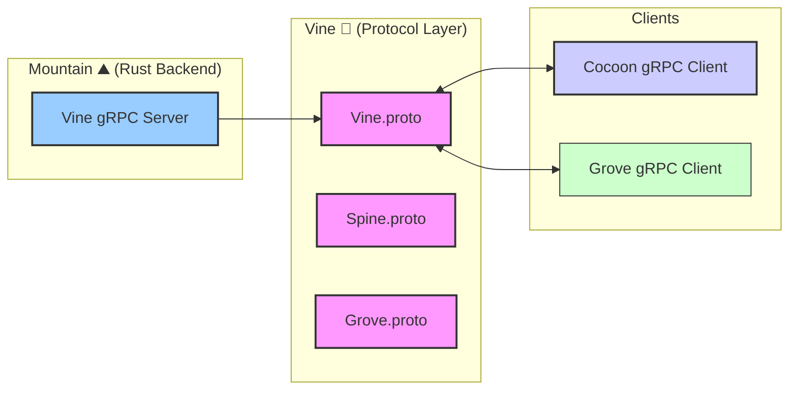

<table>
<tr>
<td align="left" valign="middle">
<h3 align="left">Vine</h3>
</td>
<td align="left" valign="middle">
<h3 align="left">🌿</h3>
</td>
<td align="left" valign="middle">
<h3 align="left">+</h3>
</td>
<td align="left" valign="middle">
<h3 align="left">
<a href="https://Editor.Land" target="_blank">
<picture>
<source media="(prefers-color-scheme: dark)" srcset="https://PlayForm.Cloud/Dark/Image/GitHub/Land.svg">
<source media="(prefers-color-scheme: light)" srcset="https://PlayForm.Cloud/Image/GitHub/Land.svg">

</picture>
</a>
</h3>
</td>
<td align="left" valign="middle">
<h3 align="left">
<a href="https://Editor.Land" target="_blank">
Land
</a>
</h3>
</td>
<td align="left" valign="middle">
<h3 align="left">🏞️</h3>
</td>
</tr>
</table>

---

# **Vine**&#x2001;🌿

> **Electron's IPC is untyped. You send a string event name and hope the handler matches. Refactoring a message field breaks things silently in production. There is no schema validation at the wire.**

_"Change a message field and every consumer breaks loudly at compile time, not silently at runtime."_

&#x2001;

Every inter-process service interface starts as a `.proto` file. The generated Rust and TypeScript stubs are the only way Land processes communicate. gRPC over a Unix domain socket runs at native memory-copy speed: microseconds for any message under 64KB. Changing a message field breaks every consumer at compile time.

---

## What It Does&#x2001;🔐

- **Typed at the wire.** Every message is a `.proto` contract compiled to Rust and TypeScript stubs.
- **Compile-time safety.** Change a field and every consumer breaks at the compiler, not in production.
- **Microsecond latency.** gRPC over Unix domain socket runs at memory-copy speed.
- **Versioned protocol.** The `.proto` file is the single source of truth for all IPC.

---

## In the Ecosystem&#x2001;🌿 + 🏞️

---

## Development&#x2001;🛠️

Vine is a component of the Land workspace. Follow the
[Land Repository](https://github.com/CodeEditorLand/Land) instructions to
build and run.

---

## License&#x2001;⚖️

CC0 1.0 Universal. Public domain. No restrictions.
[LICENSE](https://github.com/CodeEditorLand/Vine/tree/Current/LICENSE)

---

## See Also

- [Vine Documentation](https://editor.land/Doc/vine)
- [Architecture Overview](https://editor.land/Doc/architecture)
- [Why gRPC](https://editor.land/Doc/why-grpc)
- [Mountain](https://github.com/CodeEditorLand/Mountain)
- [Cocoon](https://github.com/CodeEditorLand/Cocoon)

## Funding & Acknowledgements 🙏🏻

Code Editor Land is funded through the NGI0 Commons Fund, established by NLnet
with financial support from the European Commission's Next Generation Internet
programme, under grant agreement No. 101135429.

The project is operated by PlayForm, based in Sofia, Bulgaria.

PlayForm acts as the open-source steward for Code Editor Land under the NGI0
Commons Fund grant.

<table>
	<thead>
		<tr>
			<th align="left"><strong>Land</strong></th>
			<th align="left"><strong>PlayForm</strong></th>
			<th align="left"><strong>NLnet</strong></th>
			<th align="left"><strong>NGI0 Commons Fund</strong></th>
		</tr>
	</thead>
	<tbody>
		<tr>
			<td align="left" valign="middle">
				
			</td>
			<td align="left" valign="middle">
				
			</td>
			<td align="left" valign="middle">
				
			</td>
			<td align="left" valign="middle">
				
			</td>
		</tr>
	</tbody>
</table>

---

**Project Maintainers**: Source Open
([Source/Open@Editor.Land](mailto:Source/Open@Editor.Land)) |
[GitHub Repository](https://github.com/CodeEditorLand/Vine) |
[Report an Issue](https://github.com/CodeEditorLand/Vine/issues) |
[Security Policy](https://github.com/CodeEditorLand/Vine/security/policy)
