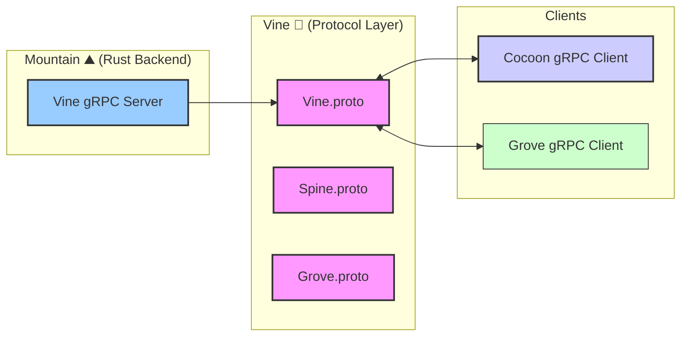

<table>
<tr>
<td align="left" valign="middle">
<h3 align="left">Vine</h3>
</td>
<td align="left" valign="middle">
<h3 align="left">🌿</h3>
</td>
<td align="left" valign="middle">
<h3 align="left">+</h3>
</td>
<td align="left" valign="middle">
<h3 align="left">
<a href="https://Editor.Land" target="_blank">
<picture>
<source media="(prefers-color-scheme: dark)" srcset="https://PlayForm.Cloud/Dark/Image/GitHub/Land.svg">
<source media="(prefers-color-scheme: light)" srcset="https://PlayForm.Cloud/Image/GitHub/Land.svg">

</picture>
</a>
</h3>
</td>
<td align="left" valign="middle">
<h3 align="left">
<a href="https://Editor.Land" target="_blank">
Land
</a>
</h3>
</td>
<td align="left" valign="middle">
<h3 align="left">🏞️</h3>
</td>
</tr>
</table>

---

# **Vine**&#x2001;🌿

The gRPC Protocol Layer for Land 🏞️

[](https://github.com/CodeEditorLand/Vine/tree/Current/LICENSE)
[](https://www.rust-lang.org/)&#x2001;[](https://github.com/CodeEditorLand/Vine)

Welcome to **Vine**, the gRPC protocol definition and communication
specification for the **Land Code Editor** ecosystem. Vine defines the
strongly-typed IPC layer used for communication between `Mountain` (Rust
backend) and `Cocoon` (Node.js extension host), as well as the planned `Grove`
(Rust/WASM extension host).

**Vine** is engineered to:

1. **Define Protocol Contracts:** Provide `.proto` files that specify the gRPC
   service definitions for all inter-component communication.
2. **Enable Strong Typing:** Ensure type-safe communication through Protocol
   Buffers and generated Rust/TypeScript code.
3. **Support Multiple Transports:** Design for transport agnosticism with
   support for TCP, IPC, and WASM host functions.
4. **Implement Health Monitoring:** Provide heartbeat and connection state
   management for reliable communication.

---

## Key Features&#x2001;🔐

- **Protocol Buffer Definitions:** `.proto` files specifying gRPC service
  definitions for all inter-component communication.
- **Strong Typing:** Type-safe communication through Protocol Buffers with
  generated Rust and TypeScript code.
- **Transport Agnosticism:** Designed for multiple transport backends including
  TCP, IPC, and WASM host functions.
- **Health Monitoring:** Built-in heartbeat and connection state management for
  reliable communication.
- **Spine Protocol:** Extension host coordination using action/response pattern
  for command execution.

---

## Core Architecture Principles&#x2001;🏗️

| Principle                 | Description                                                                         | Key Components Involved                   |
| :------------------------ | :---------------------------------------------------------------------------------- | :---------------------------------------- |
| **Contract-First**        | Define all service interfaces in `.proto` files before implementation.              | `Proto/*.proto`, protocol buffer compiler |
| **Type Safety**           | Generate strongly-typed code from protocol definitions for compile-time guarantees. | Generated Rust/TypeScript code            |
| **Transport Agnosticism** | Design protocol layer independent of specific transport implementation.             | `Transport` trait, strategy pattern       |
| **Health Awareness**      | Built-in connection monitoring and heartbeat for reliability.                       | Health check messages, timeout handling   |

---

## `Vine` in the Land Ecosystem&#x2001;🌿 + 🏞️

| Component          | Role & Key Responsibilities                                  |
| :----------------- | :----------------------------------------------------------- |
| **gRPC Server**    | Hosted by `Mountain` for extension host communication.       |
| **gRPC Client**    | Used by `Cocoon` and `Grove` to communicate with `Mountain`. |
| **Spine Protocol** | Extension host coordination layer for command execution.     |

---

## System Architecture Diagram&#x2001;🏗️

This diagram illustrates `Vine`'s role as the gRPC protocol layer in the Land
ecosystem.



---

## Protocol Structure

```
Element/Vine/
├── Proto/
│   ├── Vine.proto           # Core Mountain↔Cocoon communication
│   ├── Spine.proto          # Extension host coordination protocol
│   └── Grove.proto          # Grove-specific extensions
├── Source/
│   ├── lib.rs               # Protocol library
│   ├── Message/             # Message type definitions
│   ├── Service/             # gRPC service implementations
│   └── Client/              # Protocol clients
└── Documentation/
    └── Protocol.md          # Protocol specification
```

---

## Deep Dive & Component Breakdown&#x2001;🔬

The current protocol implementation resides in the consuming components:

- **`Mountain`**: gRPC server implementation in `Vine/` directory
- **`Cocoon`**: gRPC client implementation in `Services/MountainGRPCClient.ts`

When fully implemented, the protocol structure will include:

- **[`Proto/Vine.proto`](Proto/Vine.proto)** - Core Mountain↔Cocoon
  communication
- **[`Proto/Spine.proto`](Proto/Spine.proto)** - Extension host coordination
  protocol (action/response pattern for command execution)
- **[`Proto/Grove.proto`](Proto/Grove.proto)** - Grove-specific extensions for
  WASM extension host integration
- **[`Source/`](https://github.com/CodeEditorLand/Vine/tree/Current/Source/)** -
  Rust implementation
- **[`Source/Message/`](https://github.com/CodeEditorLand/Vine/tree/Current/Source/Message/)** -
  Message type definitions
- **[`Source/Service/`](https://github.com/CodeEditorLand/Vine/tree/Current/Source/Service/)** -
  gRPC service implementations

For the current protocol specification, refer to the
[Spine Contract](https://github.com/CodeEditorLand/Land/tree/Current/Documentation/Architecture/integration/SpineContract.md)
documentation.

---

## Getting Started&#x2001;🚀

### Current Status

`Vine` is currently a placeholder for the gRPC protocol definitions. The actual
protocol implementation resides in:

- **`Mountain`**: gRPC server implementation in `Vine/` directory
- **`Cocoon`**: gRPC client implementation in `Services/MountainGRPCClient.ts`

### Future Usage

When fully implemented, `Vine` will be used as:

```toml
[dependencies]
Vine = { git = "https://github.com/CodeEditorLand/Vine.git", branch = "Current" }
```

**Key Dependencies (planned):**

- `tonic`: Rust gRPC framework
- `prost`: Protocol Buffers implementation
- `@grpc/grpc-js`: Node.js gRPC client (for Cocoon)

---

## Development Status

| Feature           | Status                              |
| ----------------- | ----------------------------------- |
| Proto Definitions | ⏳ Planned                          |
| gRPC Services     | ⏳ Planned                          |
| Spine Protocol    | 📝 Specified (see SpineContract.md) |
| Health Monitoring | ⏳ Planned                          |
| Message Types     | ⏳ Planned                          |

---

## See Also

- [Vine Documentation](https://editor.land/Doc/vine)
- [Architecture Overview](https://editor.land/Doc/architecture)
- [Why gRPC](https://editor.land/Doc/why-grpc)
- [Mountain](https://github.com/CodeEditorLand/Mountain)
- [Cocoon](https://github.com/CodeEditorLand/Cocoon)
- [Spine Contract](https://github.com/CodeEditorLand/Land/tree/Current/Documentation/Architecture/integration/SpineContract.md)

---

## License&#x2001;⚖️

This project is released into the public domain under the **Creative Commons CC0
Universal** license. You are free to use, modify, distribute, and build upon
this work for any purpose, without any restrictions. For the full legal text,
see the [`LICENSE`](https://github.com/CodeEditorLand/Vine/tree/Current/) file.

---

## Changelog&#x2001;📜

Stay updated with our progress! See
[`CHANGELOG.md`](https://github.com/CodeEditorLand/Vine/tree/Current/) for a
history of changes specific to **Vine**.

---

## Funding \& Acknowledgements&#x2001;🙏🏻

**Vine** is a core element of the **Land** ecosystem. This project is funded
through [NGI0 Commons Fund](https://NLnet.NL/commonsfund), a fund established by
[NLnet](https://NLnet.NL) with financial support from the European Commission's
[Next Generation Internet](https://ngi.eu) program. Learn more at the
[NLnet project page](https://NLnet.NL/project/Land).

The project is operated by PlayForm, based in Sofia, Bulgaria.

PlayForm acts as the open-source steward for Code Editor Land under the NGI0
Commons Fund grant.

<table>
	<thead>
		<tr>
			<th align="left"><strong>Land</strong></th>
			<th align="left"><strong>PlayForm</strong></th>
			<th align="left"><strong>NLnet</strong></th>
			<th align="left"><strong>NGI0 Commons Fund</strong></th>
		</tr>
	</thead>
	<tbody>
		<tr>
			<td align="left" valign="middle">
				<a href="https://Editor.Land">
					
				</a>
			</td>
			<td align="left" valign="middle">
				<a href="https://PlayForm.Cloud">
					
				</a>
			</td>
			<td align="left" valign="middle">
				<a href="https://NLnet.NL">
					
				</a>
			</td>
			<td align="left" valign="middle">
				<a href="https://NLnet.NL/commonsfund">
					
				</a>
			</td>
		</tr>
	</tbody>
</table>

---

**Project Maintainers**: Source Open
([Source/Open@Editor.Land](mailto:Source/Open@Editor.Land)) |
[GitHub Repository](https://github.com/CodeEditorLand/Vine) |
[Report an Issue](https://github.com/CodeEditorLand/Vine/issues) |
[Security Policy](https://github.com/CodeEditorLand/Vine/security/policy)
