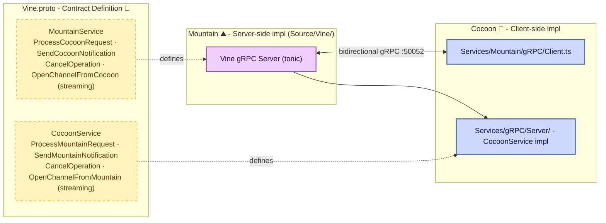

# **Vine** 🍇

The gRPC protocol layer for the Land editor.

[](https://github.com/CodeEditorLand/Vine/tree/Current/LICENSE)

---

## Overview

**Vine** is the gRPC protocol definition and communication specification for the **Land Code Editor** ecosystem. Vine defines the strongly-typed IPC layer used for communication between **Mountain** (Rust backend) and **Cocoon** (Node.js extension host / Rust/WASM extension host).

**Vine** is engineered to:

1. **Define Protocol Contracts:** Provide `.proto` files that specify the gRPC service definitions for all inter-component communication.
2. **Enable Strong Typing:** Ensure type-safe communication through Protocol Buffers and generated Rust/TypeScript code.
3. **Support Multiple Transports:** Design for transport agnosticism with support for TCP, IPC, and WASM host functions.
4. **Implement Health Monitoring:** Provide heartbeat and connection state management for reliable communication.

## Architecture



### Core Architecture Principles

| Principle | Description | Key Components Involved |
| :-------- | :---------- | :---------------------- |
| **Contract-First** | Define all service interfaces in `.proto` files before implementation. | `Proto/*.proto`, protocol buffer compiler |
| **Type Safety** | Generate strongly-typed code from protocol definitions for compile-time guarantees. | Generated Rust/TypeScript code |
| **Transport Agnosticism** | Design protocol layer independent of specific transport implementation. | `Transport` trait, strategy pattern |
| **Health Awareness** | Built-in connection monitoring and heartbeat for reliability. | Health check messages, timeout handling |

## Key Components

| Component | Path | Description |
| --------- | ---- | ----------- |
| gRPC Server | `Mountain/Source/Vine/` | Rust-side gRPC server (tonic) hosted by **Mountain** for extension host communication. |
| gRPC Client | `Cocoon/Source/Services/Mountain/gRPC/Client.ts` | TypeScript-side gRPC client used by **Cocoon** and **Grove** to communicate with **Mountain**. |
| Core Protocol | `Mountain/Proto/Vine.proto` | Core **Mountain**↔**Cocoon** gRPC service definitions. |
| Spine Protocol | (To be centralized) | Extension host coordination using action/response pattern for command execution. |
| Route Manifest | `Cocoon/Source/Generated/RouteManifest.ts` | Auto-generated routing tier enumeration. |

## In the Land Project

**Vine** defines the contract for all inter-component gRPC communication. It is the protocol layer that connects the Land editor's components.

**Vine** is part of the networking/IPC connectivity stack alongside **Air** 🪁 (background daemon, uses Vine/gRPC on port 50053) and **Mist** 🌫️ (DNS isolation, used by Air's HTTP client).

| Role | Component | Port | Details |
| :--- | :-------- | :--- | :------ |
| **gRPC Server** | **Mountain** ⛰️ | `50052` | Hosts `Vine.proto` gRPC services for extension host communication. |
| **gRPC Client** | **Cocoon** 🦋 | — | Consumes Mountain gRPC services, also hosts `CocoonService`. |
| **gRPC Client** | **Grove** 🌳 | — | Consumes Mountain gRPC services. |
| **Spine Protocol** | **Mountain** ↔ **Cocoon** | — | Extension host coordination layer for command execution. |

### Protocol Structure

The protocol definitions currently live inside the consuming components, not a standalone directory. The future **Vine** package will centralize these:

| File | Location (today) | Purpose |
| :--- | :--------------- | :------ |
| `Vine.proto` | `Mountain/Proto/Vine.proto` | Core **Mountain**↔**Cocoon** gRPC service definitions |
| Server impl | `Mountain/Source/Vine/` | Rust-side gRPC server (`tonic`) |
| Client impl | `Cocoon/Source/Services/Mountain/gRPC/Client.ts` | TypeScript-side gRPC client |
| `RouteManifest.ts` | `Cocoon/Source/Generated/RouteManifest.ts` | Auto-generated routing tier enumeration |

### Service Definitions

The current protocol defines two bidirectional gRPC services:

- **MountainService** — `ProcessCocoonRequest`, `SendCocoonNotification`, `CancelOperation`, `OpenChannelFromCocoon` (streaming)
- **CocoonService** — `ProcessMountainRequest`, `SendMountainNotification`, `CancelOperation`, `OpenChannelFromMountain` (streaming)

### Port Allocation

| Process | Port | Protocol | Purpose |
| :------ | :--- | :------- | :------ |
| **Cocoon** | `50052` | `Vine.proto` (gRPC) | VS Code extension hosting |
| **Air** | `50053` | **Vine**/`Air.proto` (gRPC) | Daemon services — updates, downloads |

## Getting Started

### Current Status

**Vine** is currently a placeholder for the gRPC protocol definitions. The actual protocol implementation resides in:
- **Mountain**: gRPC server implementation in `Vine/` directory
- **Cocoon**: gRPC client implementation in `Services/MountainGRPCClient.ts`

### Future Usage

When fully implemented, **Vine** will be used as:

```toml
[dependencies]
Vine = { git = "https://github.com/CodeEditorLand/Vine.git", branch = "Current" }
```

**Key Dependencies (planned):**
- `tonic`: Rust gRPC framework
- `prost`: Protocol Buffers implementation
- `@grpc/grpc-js`: Node.js gRPC client (for Cocoon)

### Development Status

| Feature | Status |
| ------- | ------ |
| Proto Definitions | ⏳ Planned |
| gRPC Services | ⏳ Planned |
| Spine Protocol | 📝 Specified (see SpineContract.md) |
| Health Monitoring | ⏳ Planned |
| Message Types | ⏳ Planned |

## API Reference

When fully implemented, Rust API documentation will be available at `https://Rust.Documentation.editor.land/Vine/`.

## Related Documentation

- [Architecture Overview](../Documentation/GitHub/Architecture.md) — Internal module structure
- [Deep Dive](../Documentation/GitHub/DeepDive.md) — In-depth technical details
- [Land Documentation](../../Documentation/GitHub/README.md) — Complete documentation index
- **Air** 🪁 — Background daemon using Vine/gRPC on port 50053 — [GitHub](https://github.com/CodeEditorLand/Air)
- **Mist** 🌫️ — DNS isolation for the private network — [GitHub](https://github.com/CodeEditorLand/Mist)
- **Mountain** ⛰️ — gRPC server host — [GitHub](https://github.com/CodeEditorLand/Mountain)
- **Cocoon** 🦋 — gRPC client host — [GitHub](https://github.com/CodeEditorLand/Cocoon)

---

## Funding

This project is funded through [NGI0 Commons Fund](https://NLnet.NL/commonsfund), a fund established by [NLnet](https://NLnet.NL) with financial support from the European Commission's Next Generation Internet program, under grant agreement No 101135429.

The project is operated by PlayForm, based in Sofia, Bulgaria. PlayForm acts as the open-source steward for Code Editor Land under the NGI0 Commons Fund grant.

| | |
| --- | --- |
| [](https://Editor.Land) | [](https://PlayForm.Cloud) |
| [](https://NLnet.NL) | [](https://NLnet.NL/commonsfund) |

---

**Project Maintainers**: Source Open (Source/Open@editor.land) | [GitHub Repository](https://github.com/CodeEditorLand/Vine) | [Report an Issue](https://github.com/CodeEditorLand/Vine/issues) | [Security Policy](https://github.com/CodeEditorLand/Vine/security/policy)
